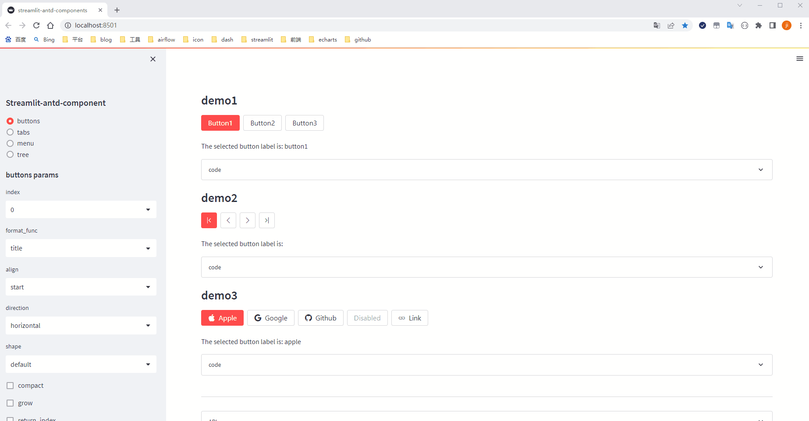
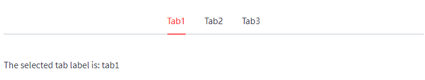
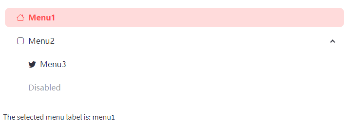
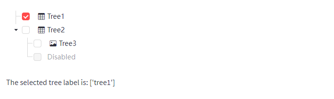
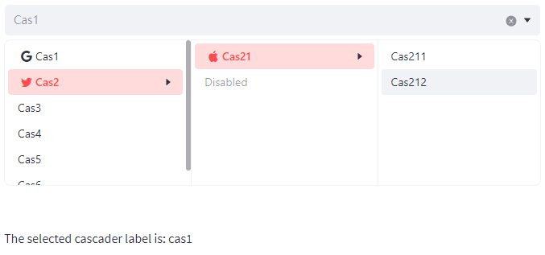
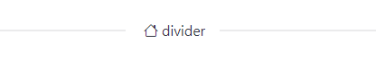

# Streamlit-Antd-Components

A Streamlit component to display [Antd-Design](https://ant.design/).

Check out the [Demo](https://nicedouble-streamlitantdcomponentsdemo-app-middmy.streamlit.app/) for more example.


**highlight**

* support streamlit theme(light or dark mode,or custom theme)
* support [Bootstrap Icon](https://icons.getbootstrap.com/)
* more style params
* multiple nested items in menu and tree

## Install

```shell script
pip install streamlit-antd-components
```

## Usage

This library now provides 4 component:

- `buttons` A group of buttons component.
- `tabs` A tabs component.
- `menu` A versatile menu for navigation
- `tree` A hierarchical list structure component.

### buttons example

```python
import streamlit as st
from streamlit_antd_components import buttons

btn = buttons(['button1', 'button2', 'button3'], align='center', shape='round', format_func='title')
st.write(f'The selected button label is: {btn}')
```


### tabs example

```python
import streamlit as st
from streamlit_antd_components import tabs

tab = tabs(['tab1', 'tab2', 'tab3'], align='center', format_func='title')
st.write(f'The selected tab label is: {tab}')
```



### menu example

```python
import streamlit as st
from streamlit_antd_components import menu, MenuItem

item = menu([
    MenuItem('menu1', icon='house'),
    MenuItem('menu2', icon='app', children=[
        MenuItem('menu3', icon='twitter'),
        MenuItem('disabled', disabled=True),
    ]),
], format_func='title', open_all=True)
st.write(f'The selected menu label is: {item}')

```



### tree example

```python
import streamlit as st
from streamlit_antd_components import tree, TreeItem

item = tree([
    TreeItem('tree1', icon='table'),
    TreeItem('tree2', icon='table', children=[
        TreeItem('tree3', icon='image'),
        TreeItem('disabled', disabled=True),
    ]),
], index=0, format_func='title', open_all=True, checkbox=True, show_line=True)
st.write(f'The selected tree label is: {item}')
```



### cascader example

```python
import streamlit as st
from streamlit_antd_components import cascader, CasItem

item = cascader(
    items=[
        CasItem('cas1', icon='google'),
        CasItem('cas2', icon='twitter', children=[
            CasItem('cas3', icon='apple'),
            CasItem('disabled', disabled=True),
        ]),
        CasItem('cas4'),
    ], index=0, format_func='title', clear=True)
st.write(f'The selected cascader label is: {item}')
```



### switch example

```python
import streamlit as st
from streamlit_antd_components import switch, BsIcon

s = switch(value=True, checked=BsIcon('sun'), unchecked=BsIcon('moon'))
st.write(f'switch return value :{s}')
```


### divider example

```python
from streamlit_antd_components import divider

divider(label='divider', icon='house')
```


