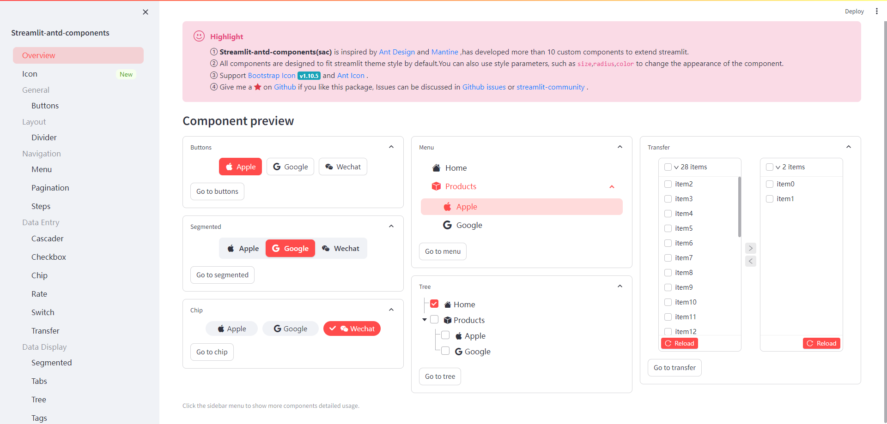
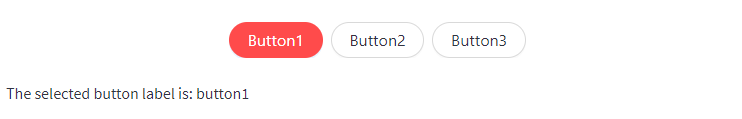

# Streamlit-Antd-Components

[![Open in Streamlit][share_badge]][share_link] 
[![GitHub][github_badge]][github_link] 
[![PyPI][pypi_badge]][pypi_link]
[![download][download_badge]][download_link]

A Streamlit custom component to implement [Antd-Design](https://ant.design/) and [Mantine](https://v6.mantine.dev/) widgets.

Check out the [Demo App][share_link] for more example.



This library now provides component blow:

- `buttons` A group of buttons component.
- `divider` A divider line separates different content
- `menu` A versatile menu for navigation
- `steps` A navigation bar that guides users through the steps of a task
- `cascader` Chooses cascade items in one float layer for better user experience.
- `checkbox` A group of checkbox.
- `rate` Rate component
- `switch` Switching between two states or on-off state
- `transfer` Double column transfer choice box
- `segmented` Segmented Controls.
- `tabs` A tabs component.
- `tree` A hierarchical list structure component.
- `alert` Alert component for feedback
- `result` Used to feed back the results of a series of operational tasks
- `tag` Tag for categorizing or markup
- `pagination` A long list can be divided into several pages

## Install

```shell script
pip install streamlit-antd-components
```

## Quickstart

Create a group of buttons,use more style params.

```python
import streamlit as st
import streamlit_antd_components as sac

btn = sac.buttons(
    items=['button1', 'button2', 'button3'],
    index=0,
    format_func='title',
    align='center',
    direction='horizontal',
    radius='lg',
    return_index=False,
)
st.write(f'The selected button label is: {btn}')
```



## Todo

- pop-up component
- ~~Interaction between components~~
- ~~Add component callback function~~
- multiple sac components


[share_badge]: https://static.streamlit.io/badges/streamlit_badge_black_white.svg

[share_link]: https://nicedouble-streamlitantdcomponentsdemo-app-middmy.streamlit.app/

[github_badge]: https://badgen.net/badge/icon/GitHub?icon=github&color=black&label

[github_link]: https://github.com/nicedouble/StreamlitAntdComponents

[pypi_badge]: https://badgen.net/pypi/v/streamlit-antd-components

[pypi_link]: https://pypi.org/project/streamlit-antd-components/

[download_badge]: https://badgen.net/pypi/dm/streamlit-antd-components

[download_link]: https://pypi.org/project/streamlit-antd-components/#files

# Developer mode
In `frontend` folder run
```sh
npm install
npm run build
```

Then in source, you can debug the components in the [demo app](https://github.com/nicedouble/StreamlitAntdComponentsDemo). Via
```py
pip install .
```