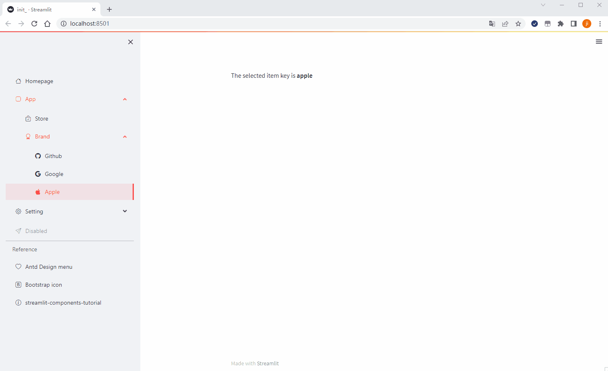
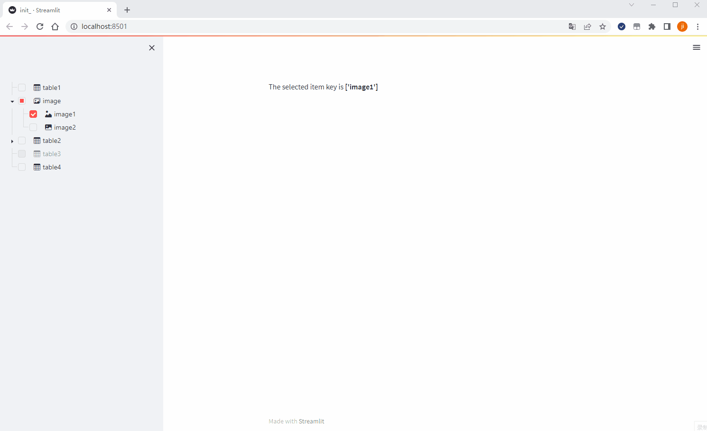

# Streamlit-Antd-Components

A Streamlit component to display [Antd-Design](https://ant.design/). 

## Install

```shell script
pip install streamlit-antd-components
```

## Usage

This library now provides two component:

- `antd_menu` A versatile menu for navigation
- `antd_tree` A hierarchical list structure component.


### antd_menu

**Hightlights**

* support nested menus
* support streamlit theme(light or dark mode,or custom theme)
* support [Bootstrap Icon](https://icons.getbootstrap.com/)
* support hyperlink menu

**Demo**


**Demo code**

```python
import streamlit as st
from streamlit_antd_components import antd_menu, MenuItem, MenuDivider

items = [
    MenuItem('Homepage', 'homepage', icon='house'),
    MenuItem('App', 'app', icon='app', children=[
        MenuItem('Store', 'store', icon='bag-check'),
        MenuItem('Brand', 'brand', icon='award', children=[
            MenuItem('Github', 'github', icon='github'),
            MenuItem('Google', 'google', icon='google'),
            MenuItem('Apple', 'apple', icon='apple'),
        ]),
    ]),
    MenuItem('Setting', 'setting', icon='gear', children=[
        MenuItem('Admin', 'admin', icon='person-circle'),
        MenuItem('Guest', 'guest', icon='person'),
    ]),
    MenuItem('Disabled', 'disabled', icon='send', disabled=True),
    MenuDivider(),
    MenuItem('Reference', 'reference', children_as_group=True, children=[
        MenuItem('Antd Design menu', 'antd', icon='heart', href='https://ant.design/components/menu#menu'),
        MenuItem('Bootstrap icon', 'icon', icon='bootstrap', href='https://icons.getbootstrap.com/'),
        MenuItem('streamlit-components-tutorial', 'sct', icon='info-circle',
                 href='https://streamlit-components-tutorial.netlify.app/'),
    ]),
]
with st.sidebar.container():
    item = antd_menu(
        items=items,
        selected_key='apple',
    )
st.write(f'The selected item key is **{item}**')
```

### antd_tree

**Hightlights**

* support nested tree
* support streamlit theme(light or dark mode,or custom theme)
* support [Bootstrap Icon](https://icons.getbootstrap.com/)
* support checkbox to multiple select

* **Demo**
  

**Demo code**

```python
import streamlit as st
from streamlit_antd_components import antd_tree, TreeItem

with st.sidebar.container():
    data = [
        TreeItem('table1', 'table1'),
        TreeItem('image', 'image', icon='images', children=[
            TreeItem('image1', 'image1', icon='image-alt'),
            TreeItem('image2', 'image2', icon='image-fill'),
        ]),
        TreeItem('table2', 'table2', children=[
            TreeItem('table2-1', 'table2-1'),
            TreeItem('table2-2', 'table2-2'),
        ]),
        TreeItem('table3', 'table3', disabled=True),
        TreeItem('table4', 'table4'),
    ]
    item = antd_tree(
        items=data,
        selected_keys=['image1'],
        checkbox=True,
        show_line=True,
        icon='table',
    )
st.write(f'The selected item key is **{item}**')
```
